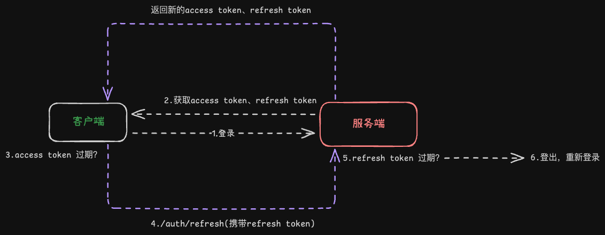

## Description

[Mapaw] Your AI travel and adventure partner.

CORE by: [Nest](https://github.com/nestjs/nest)

## dev 环境下使用
synchronize 来启用自动同步生成表


## Auth 鉴权
注册 → 登录 → 颁发 Token → 携带 Token 请求 API → Token 过期 → 刷新 → 继续请求

### Token 类型
#### Access Token
> 临时身份凭证 - 访问业务API - 客户端内存

#### Refresh Token
> 长期通行证 - 更新 Access - 数据库+客户端


### Token出生点
> 登录成功那一刻，由 Nest 颁发并提供给客户端

### Token Strategy 校验策略

- JwtStrategy
- RefreshStrategy

#### JwtStrategy
1. 从 header 获取 accessToken
2. 验证
3. 解析 payload
4. 返回 user 信息


✔ 成功 → 进入 Controller

❌ 失败 → 401

#### RefreshStrategy
1. 从 body 获取 refreshToken
2. 验证
3. 查数据库
    - 是否存在
    - 是否被 revoke?
    - 是否过期

4. 找到 user

✔ 成功 → 重新签发 Access Token

❌ 失败 → 强制重新登录



## Installation
```bash
$ pnpm install
```

## Running the app

```bash
# development
$ pnpm run start

# watch mode
$ pnpm run start:dev

# production mode
$ pnpm run start:prod
```

## Test

```bash
# unit tests
$ pnpm run test

# e2e tests
$ pnpm run test:e2e

# test coverage
$ pnpm run test:cov
```

## Support

Nest is an MIT-licensed open source project. It can grow thanks to the sponsors and support by the amazing backers. If you'd like to join them, please [read more here](https://docs.nestjs.com/support).

## Stay in touch

- Author - [Kamil Myśliwiec](https://kamilmysliwiec.com)
- Website - [https://nestjs.com](https://nestjs.com/)
- Twitter - [@nestframework](https://twitter.com/nestframework)

## License

Nest is [MIT licensed](LICENSE).
